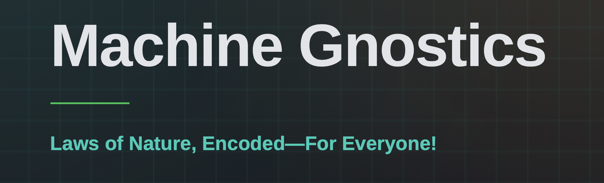
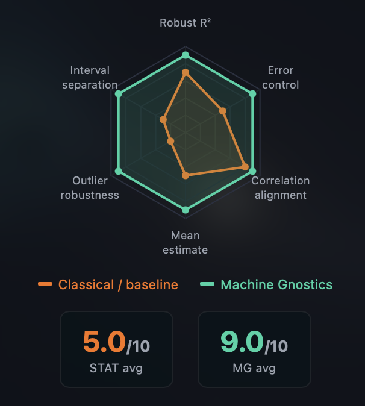
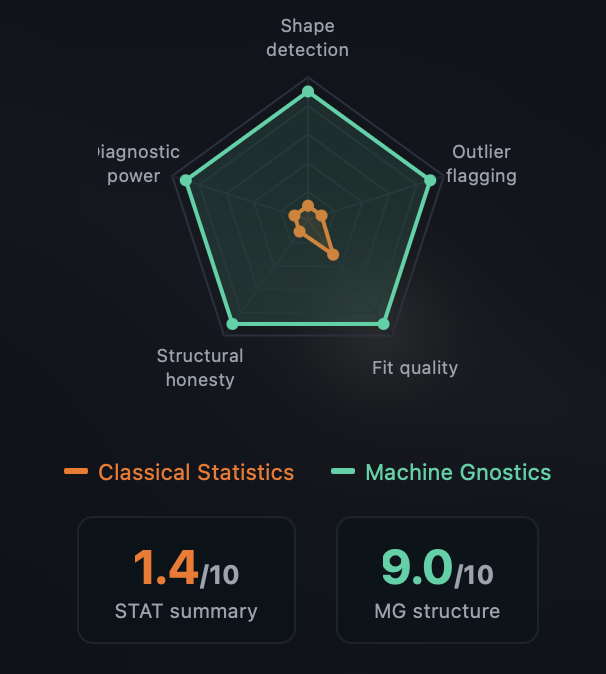

# [Machine Gnostics](https://machinegnostics.com)

<div align="center">
  
</div>

---

[](https://pypi.org/project/machinegnostics/) [](https://pypi.org/project/machinegnostics/) [](https://www.gnu.org/licenses/gpl-3.0) [](https://pepy.tech/project/machinegnostics) [](https://pepy.tech/project/machinegnostics) [](https://github.com/MachineGnostics/machinegnostics)

> **Machine Gnostics: Laws of Nature, Encoded — For Everyone!**

**Machine Gnostics** is a Python library for robust, assumption-free data analysis and machine learning. It replaces the probabilistic assumptions of classical statistics with **Mathematical Gnostics** — a deterministic, finite, algebraic theory rooted in Riemannian geometry, Einsteinian relativity, vector bi-algebra, and thermodynamics.

The result: analysis that treats **every data point as a real event** with its own importance and uncertainty — resilient to outliers, honest about structure, and reliable even on small datasets.

---

## Why Machine Gnostics?

- Non-statistical by design — deterministic gnostic algebra instead of probability and averages
- Outlier-resilient — gnostic weights automatically downweight leverage and corruption
- Finite theory for finite data — works directly with small, real-world datasets
- Structure-aware — detects curves, clusters, and degenerate cases that summary statistics flatten
- Deep learning with MAGNET — PyTorch-backed neural networks with gnostic layers
- Classical + gnostic metrics — accuracy, R2, F1 alongside gnostic mean, relevance, entropy
- MLflow integration — tracking, registry, reproducibility

---

## Benchmark: Anscombe's Quartet

> **[▶ View the interactive benchmark on machinegnostics.com](https://machinegnostics.com/benchmark/)**

Four datasets share **identical classical statistics** — mean x≈9, mean y≈7.5, r²≈0.67, slope≈0.5 — yet they are radically different: linear, parabolic, outlier-distorted, and degenerate. Classical statistics reports the same summary for all four. Machine Gnostics reads the structure of each.

**Key results**

| Case | Classical Statistics | Machine Gnostics |
|------|----------------------|------------------|
| Dataset I — linear | ✅ Fit is valid | ✅ Fit is valid |
| Dataset II — parabola | ❌ Linear fit is structurally wrong | ✅ Parabolic shape exposed via weight pattern |
| Dataset III — outlier | ❌ One high-leverage point distorts the line | ✅ Outlier weight ≈ 0.04 — leverage removed |
| Dataset IV — degenerate | ❌ Regression is meaningless | ✅ Vertical cluster flagged as degenerate |

**Capability radar (1–10)**

| Capability | Classical | Machine Gnostics |
|------------|:---------:|:----------------:|
| Shape detection | 1 | **9** |
| Outlier flagging | 1 | **9** |
| Fit quality | 3 | **9** |
| Structural honesty | 1 | **9** |
| Diagnostic power | 1 | **9** |
| **Average** | **1.4** | **9.0** |

<table>
<tr>
<td align="center" style="padding:8px;">

<br><i>Image 1 — MG structural read vs classical summary (Anscombe quartet)</i>
</td>
<td align="center" style="padding:8px;">

<br><i>Image 2 — Capability radar & metrics (MG 9.0 vs Classical 1.4)</i>
</td>
</tr>
</table>

> This is the first time Machine Gnostics solves the Anscombe case through calculation — deterministic gnostic weight computation, centered coordinate, structural divergence — rather than through plotting or visual inspection alone. Numerical weights reveal the parabola, downweight the outlier (weight ~0.04), and flag the degenerate vertical cluster structurally.

> Machine Gnostics is presented as a **complementary lens** that adds structural insight — not as a replacement for classical statistics. Scores are benchmark comparisons, not peer-reviewed ratings; the direction of the difference is the key result.

---

## Installation

```bash
# create an environment (uv or venv)
uv venv .mg-env --python 3.11 && source .mg-env/bin/activate
# or: python3 -m venv .mg-env && source .mg-env/bin/activate

# install
pip install machinegnostics        # or: uv add machinegnostics
```

<details>
<summary><b>Windows</b></summary>

```cmd
uv venv .mg-env --python 3.11
.mg-env\Scripts\activate
pip install machinegnostics
```

</details>

Verify:

```python
import machinegnostics
print("imported successfully!")
```

---

## Quick Start

### Gnostic Distribution Function

```python
import numpy as np
from machinegnostics.magcal import EGDF

data = np.array([-13.5, 0, 1., 2., 3., 4., 5., 6., 7., 8., 9., 10.])
egdf = EGDF()
egdf.fit(data)
egdf.plot()
print(egdf.params)
```

### Robust Polynomial Regression

```python
import numpy as np
from machinegnostics.models import PolynomialRegressor

X = np.array([0., 0.4, 0.8, 1.2, 1.6, 2.])
y = np.array([17.89, 69.62, -7.20, 9.38, -10.56, 16.58])

model = PolynomialRegressor(degree=2)
model.fit(X, y)
print("Predictions:", model.predict(X))
print("Coefficients:", model.coefficients)
```

### Deep Learning with MAGNET

```python
from machinegnostics.magnet import Sequential, Dense, ReLU, Adam

model = Sequential(layers=[
    Dense(in_features=64, out_features=32),
    ReLU(),
    Dense(in_features=32, out_features=1),
])
model.compile(loss='mse', optimizer=Adam(lr=0.001))
model.fit(X_train, y_train, epochs=10, batch_size=32)
model.predict(X_test)
```

---

## What's Inside

| Module | Contents |
|--------|----------|
| **Data Analysis** | Gnostic distribution functions, cluster & interval analysis, gnostic data tests |
| **Machine Learning** | Regression, classification, clustering, forecasting |
| **Metrics** | Classical statistical metrics + gnostic algebra metrics (mean, median, MAE, MSE, R², relevance, entropy, …) |
| **MAGNET** | Activations, losses, initializers, optimizers, models, layers — PyTorch-backed |
| **Integration** | MLflow experiment tracking and model registry |

---

## Resources

- Documentation: [docs.machinegnostics.com](https://docs.machinegnostics.com)
- Benchmark: [machinegnostics.com/benchmark](https://machinegnostics.com/benchmark/)
- Discord: [Join the community](https://discord.gg/WMMUaeJe2X)
- YouTube: [@MachineGnostics](https://www.youtube.com/@MachineGnostics)
- LinkedIn: [Machine Gnostics](https://www.linkedin.com/company/109036022/)
- Instagram: [@machinegnostics](https://www.instagram.com/machinegnostics/)
- PyPI: [machinegnostics](https://pypi.org/project/machinegnostics/)

---

## License

Machine Gnostics is released under the [GPL v3 License](https://www.gnu.org/licenses/gpl-3.0).

---

*Machine Gnostics is a pioneering open-source initiative redefining the mathematical underpinnings of machine learning. As a young project, some features are still being refined — new models, methods, and benchmarks are on the way. Community support and collaboration are essential to building a new AI grounded in a rational and resilient paradigm.*

**Author:** Nirmal Parmar
