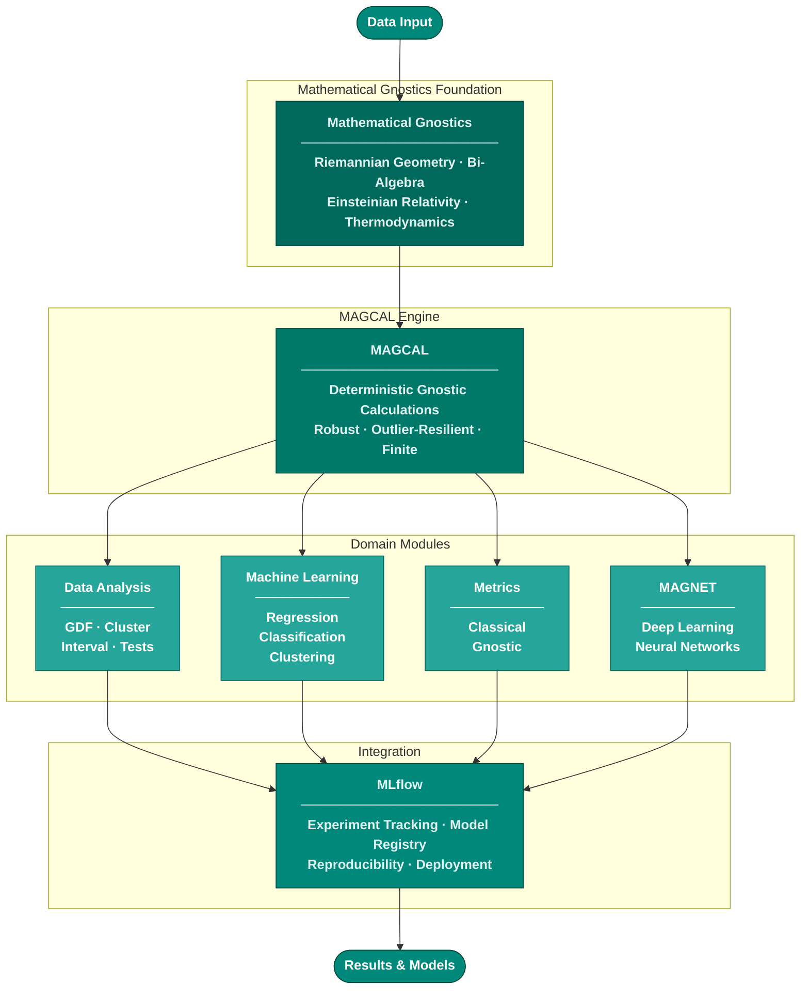

# Machine Gnostics Architecture

!!! abstract "Overview"
    **Machine Gnostics** is a deterministic, non-statistical framework for data analysis and machine learning. Unlike traditional approaches rooted in probability theory, it is built on **Mathematical Gnostics (MG)** — a finite, physically inspired algebra that treats each data point as a real event with individual importance and uncertainty.

---

## System Architecture

The diagram below shows how data flows through the Machine Gnostics system — from raw input through the Mathematical Gnostics foundation, into the MAGCAL computational engine, and out through the domain modules.

---

## Components

!!! quote "1. Data"
    The foundation of Machine Gnostics is **DATA**, interpreted differently from statistical frameworks:

    - Each data point is a **real event** with **individual importance and uncertainty**.
    - No reliance on large-sample assumptions or population-level abstractions.
    - Adheres to the principle: _"Let the data speak for themselves."_

!!! quote "2. Mathematical Gnostics"
    The **theoretical base** of the system. Replaces probabilistic assumptions with deterministic modeling:

    - Built on **Riemannian geometry**, **Einsteinian relativity**, **vector bi-algebra**, and **thermodynamics**.
    - Models uncertainty at the level of **individual events**, not populations.
    - Establishes a **finite theory for finite data** with robust treatment of variability.

!!! quote "3. MAGCAL"
    The computational engine that enables gnostic inference:

    - Performs **deterministic, non-statistical** calculations.
    - Enables **robust modeling** using gnostic algebra and error geometry.
    - Resilient to outliers, corrupted data, and distributional shifts.

!!! quote "4. Domain Modules"
    The four functional domains powered by MAGCAL:

    - **Data Analysis:** Gnostic distribution functions, cluster/interval analysis, gnostic data tests.
    - **Machine Learning:** Regression, classification, clustering, and forecasting models built on MG principles.
    - **Metrics:** Classical statistics-based metrics alongside gnostic algebra metrics (`fi`, `fj`, `hi`, `hj`, `ei`).
    - **MAGNET:** A PyTorch-backed neural network framework with gnostic activations, losses, and layers.

!!! quote "5. Integration"
    Machine Gnostics fits into modern ML workflows without friction:

    - **MLflow** provides experiment tracking, model registry, and reproducibility.
    - Deployments align with standard ML engineering practices.

---

## Summary

!!! info "Machine Gnostics vs. Traditional ML"

    | Traditional ML (Statistics)        | Machine Gnostics                         |
    |------------------------------------|------------------------------------------|
    | Based on probability theory        | Based on deterministic finite theory     |
    | Relies on large datasets           | Works directly with small datasets       |
    | Uses averages and distributions    | Uses individual error and event modeling |
    | Rooted in Euclidean geometry       | Rooted in Riemannian geometry & physics  |
    | Vulnerable to outliers             | Robust to real-world irregularities      |

---

**Glossary**

MAGCAL
:   Mathematical Gnostics Calculations and Data Analysis Models

MAGNET
:   Machine Gnostics Neural Networks — deep learning built on MG algebra with a PyTorch backend

Metrics
:   Classical statistical metrics and gnostic algebra metrics for model evaluation

MG
:   Mathematical Gnostics — the theoretical foundation

---

## [References](../ref/references.md)

> Machine Gnostics is not just an alternative — it is a **new foundation** for AI, capable of **rational, robust, and interpretable** data modeling.
